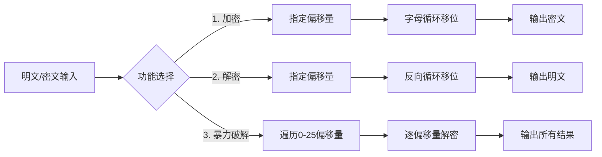

 凯撒密码作业 - Python程序设计

## 小组成员
- 姓名：[苏元]    学号：[2245315075]
- 姓名：[万美源]  学号：[2244215669]

## 项目简介
本项目实现经典凯撒密码算法，通过将英文字母按固定偏移量进行循环移位，完成信息的加密与解密。在此基础上，拓展实现了**暴力破解功能**，可在未知偏移量的情况下还原明文，提升工具实用性与创新性。

---

## 程序流程图

> 说明：加密时将字母向后偏移，解密时向前偏移，暴力破解遍历全部26种可能，通过语义识别还原明文。

---

## 功能实现
1.  **加密函数 `caesar_encrypt(text, shift)`**
    - 对英文字母（大小写）按指定偏移量循环移位
    - 数字、符号、空格等非字母字符原样保留
    - 自动对偏移量取模26，避免越界

2.  **解密函数 `caesar_decrypt(text, shift)`**
    - 本质为加密函数的逆操作，传入负偏移量实现
    - 与加密函数共用核心逻辑，保证代码复用性

3.  **暴力破解函数 `caesar_brute_force(ciphertext)`**
    - 遍历0-25所有可能的偏移量
    - 输出全部解密结果，用户可通过语义通顺性判断正确答案
    - 无需提前知晓偏移量，拓展了工具的应用场景

4.  **交互式菜单**
    - 提供「加密/解密/暴力破解」三种功能选择
    - 清晰的输入提示与结果展示，降低使用门槛

---

## 运行示例
![运行结果截图]（凯撒密码加密.png）
```

---

## 演示视频
通过网盘分享的文件：凯撒密码实操.mp4
链接: https://pan.baidu.com/s/170vZ5SYZLxdSEzRkKKGIbw?pwd=x73g 提取码: x73g

---

## 创新与拓展
1.  **暴力破解功能**：新增 `caesar_brute_force()` 函数，可在未知偏移量的情况下，遍历全部26种可能，输出所有解密结果，帮助用户快速还原明文。
2.  **交互式菜单**：提供清晰的功能选择界面，支持加密、解密、暴力破解三种场景，提升工具实用性与用户体验。
3.  **健壮性优化**：自动对偏移量取模26，避免输入过大/负数偏移量导致程序异常，增强代码稳定性。

---
